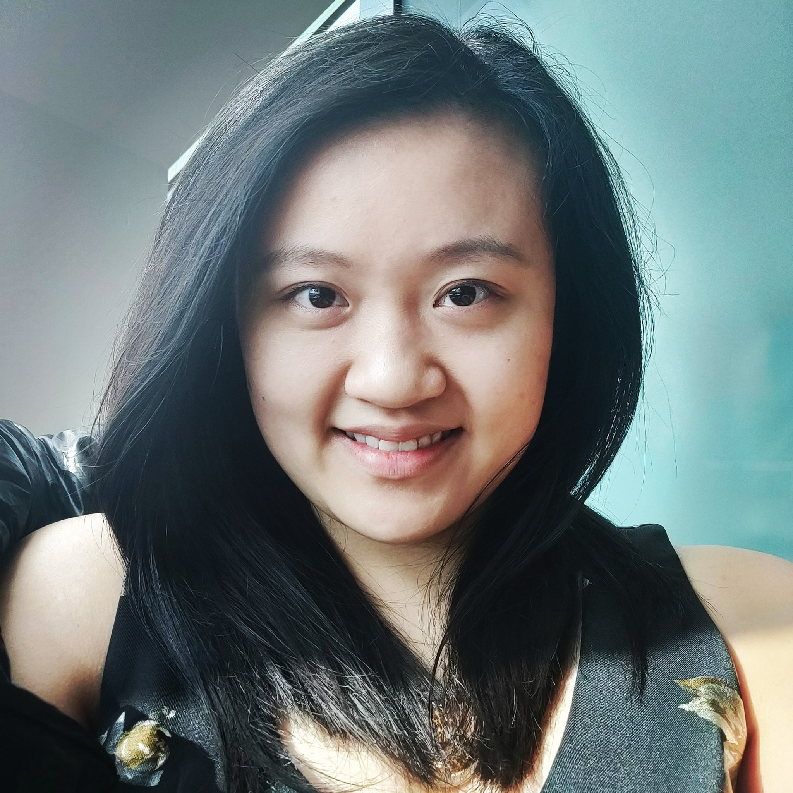

# Sophia Yang
### sophiay2@illinois.edu
### [Facebook Profile](https://www.facebook.com/sophiashiyang)
### [LinkedIn Profile](https://www.linkedin.com/in/sophia-s-yang/)
### 630-570-1868

## About Me

I am Sophia Yang and am pursuing a Bachelor of Science in Computer Science at the [University of Illinois at Urbana-Champaign](https://cs.illinois.edu) through the [Grainger College of Engineering](https://engineering.illinois.edu). I am also pursuing a [Business](https://business.illinois.edu) minor to bridge the gap between business and the technical engineering field. I am a junior and expect to graduate by May 2021 with all studies. 
                                                                                                                                                                                                    
## Experience

### INFORMATION TECHNOLOGY INTERN - APPLICATION COUPA MANAGER & DATA ANALYST, [PROCTER & GAMBLE](https://us.pg.com/) (05/2019 - 08/2019)
   - Worked in Financial and Purchasing Services & Solutions (FPSS) under the Source Plan Pay Operations (SPPO) sector to lead the discovery, documentation, and implementation of IT spend controls over the scope of more than $3,000,000,000 annually. 
   - Pinpointed risk areas for the suppliers' Information Security vetting processes, and documented the solutions to not only automate more secure control measures but also preventative stratagems for safer selections and interactions with suppliers. 
   - Enabled visibility and governance for each Business Unit and executives in both the spend and supplier security aspect
   - Used Microsoft Power BI to create data models from the Data Lake to serve the above purposes; I have experience with both local data pulls for sampling as well as creating data models using Azure on the cloud for a live-connect option (for larger datasets). 
   - Bridged the gap between transactional data (including Coupa, ProCard, and Financial Invoice data) and Information Security data (including Aravo and Third Party Risk Management data) which led efforts to upgrade the Data Lake with further data. 

### PRODUCT SUPPLY ENGINEER, SUMMER INTERN, [PROCTER & GAMBLE](https://us.pg.com/) (05/2018 – 08/2018)
  - Created real-time automation of data visualization from multiple data sources, and developed fluency in Microsoft Power BI software as well as Factory Talk View Studio. 
  - Optimized runtime speed by over 70% for data refreshes and enabled various data-fetching capabilities. Used Python to automate data fetches.
  - Developed fluency in fetching data using the REST API and creating data filters for aggregation. 
  - From development to implementation onto industrial hardware and manufacturing environment, wrote numerous technical documentations while demonstrating proof-of-concept database connections.
  
  
### COURSE ASSISTANT, [CS 233 COMPUTER ARCHITECTURE](https://cs233.github.io/) (08/2019 - PRESENT)
  - Hosted office hours
  - Ran discussion section with graduate TA
  - Proctored quizzes
  - Answered student questions on Piazza

### STUDENT CONSULTANT (L3 STUDENT SUPERVISOR), [ENGINEERING IT SHARED SERVICES](https://it.engineering.illinois.edu) (08/2017- PRESENT)
  - Resolved technical issues from clients and escalated issues from Level 1 and Level 2 Student Consultants through Request Tracker (RT) system; Issues include FastX installations (for remote EWS Linux access), Citrix Receiver server errors, print job and refunds management, etc. 
  - Managed over 30 Engineering Workstation Labs and their supply inventory
  - Managed over 50 Level 1 and Level 2 student consultants. 
  - Developed training plan for training Level 1 and 2 Student Consultants; delivered hands-on and classroom training to Level 1 and 2 Student Consultants consistently. 
  

### HELP DESK STUDENT CONSULTANT (TEAM LEAD), [TECHNOLOGY SERVICES](https://techservices.illinois.edu) (06/2017- 01/2019)
  - Resolved technical issues such as virtual private network installations, password and security management, email configuration, wifi troubles, campus netID creations, Compass learning platform troubleshooting, etc. 
  - Managed all Help Desk student consultants (~50) with other Team Leads, trained new-hire employees hands-on, and ensured event deliverables (event setup, classroom training, etc.) are achieved in a timely manner. Gave constructive feedback weekly and performance reviews semesterly (for promotions) to student consultants that I worked with most.
  - Optimized audit quality control procedures for student call and ticket monitoring. 

### COURSE ASSISTANT, [CS 125](https://cs125.cs.illinois.edu/) (01/2018 - 05/2018)
   Hosts office hours for CS 125, answers and resolves student inquiries on the Piazza forum, and guides students with the concepts of Java programming so that they may fix their own bugs. 
   
### FOUNDER AND PRESIDENT, HONORS MUSIC COMPOSITION AND PERFORMING ARTS SOCIETY (2014- 2017)
   Inspired students and developed their interests in music and the performing arts; to share the passion, I hosted nonprofit concerts based on student-composed pieces throughout the year and invited performers in the greater Chicago area, including guest artist musicians from the Chicago Youth Symphony Orchestra. With a full orchestra and choral section, I performed as both concertmaster and soprano.
   
### SHIFT LEADER AND KEY-HOLDER AT RED MANGO (2015-2017)
   As a supervisor at Red Mango, I delivered a clean, welcoming environment for customers. Aside from managing the inventory, I customized and created many new customer favorites for the menu, as well as gave customers a tailored experience suited to their needs. I lead the team here through a demonstration of excellent working habits and encouragement, and increased the sales by at least 15%. From optimizing techniques for creating menu items, I reduced the process order time by over 30%, increasing customer satisfaction.

## Education

[UNIVERSITY OF ILLINOIS AT URBANA-CHAMPAIGN](http://illinois.edu) (08/2017-PRESENT)- 3.4/4.0 

[HINSDALE CENTRAL HIGH SCHOOL](https://d86.hinsdale86.org/Domain/8) (2013-2017)- GPA 5.84/5.00

## Skills
   As a tri-linguist in English, Mandarin, and German, I have a fluent control over communication skills. I tutored all three languages to peer students as well as core classes like Calculus and AP Computer Science A, and raised their grades by 20% on average. Employed by the two main troubleshooting platforms on campus, I developed a deep understanding to a diverse range of technological issues by faculty, staff, and students. Not only do I understand the technical stance behind products of a company, I know the business model and the logics to achieve PIE: Practical, Innovative, Efficient.
   
## Awards

#### Power of You - Team Work - Procter & Gamble
Awarded for Teamwork and for recruiting efforts on campus (speaking at Tech Talk on campus, etc.)

#### Presidents Award Honors Scholar - University of Illinois at Urbana-Champaign
Awarded to the highest achieving Presidents Award Scholars (~200 across all three campuses combined)

#### James Scholar - College of Engineering - University of Illinois at Urbana-Champaign

#### [David Anderson Scholarship Award](https://it.engineering.illinois.edu/news/david-anderson-and-stephanie-ognar-honored-scholarships) - Engineering IT Shared Services - University of Illinois at Urbana-Champaign
Awarded to 1 student employee annually displaying persistence, dedication, and the pursuit of reliable, flexible IT service

#### National AP Scholar

#### Top 3% High Honor Student- Hinsdale Central High School 2017

#### Illinois State Scholar 2017

#### National Honors Society - 2016/2017

#### National German Exam Gold Medalist 2014

#### Student of the Quarter - Business Department - Hinsdale Central High School 2015 

#### Red Devil Spirit Scholarship Award - Hinsdale Central High School 2017

## Interests
I am interested in improving the efficiency of medical instruments and have done research in the meantime about how certain critical procedures are done, and how they may be innovatively improved. I trust that Computer Science will allow these changes to take place more immediately. I hold a philosophy in which I believe anything and everything has room for improvement, and it is our responsibility to find ways to continuously achieve higher. 
Musically, I play the violin and love to sing, owning a 3-octave vocal range.
Hobbies of mine including swimming and bowling, in which my Girl's Varsity Bowling Team won the first West Suburban Conference Championship in the history of Hinsdale Central High School.

## Contact
If you are interested in getting in touch with me, feel free to email me at sophiay2@illinois.edu or add me on Facebook! Life is too short for passersby to not shake hands, or even start a companionship hand in hand. <3
