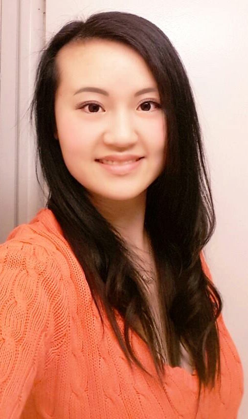

# Sophia Yang
### sophiay2@illinois.edu
### [Facebook Profile](https://www.facebook.com/sophiashiyang)
### 630-570-1868

## About Me

Hello! I'm Sophia Yang and I am pursuing a Bachelor of Science in Computer Science at the [University of Illinois at Urbana-Champaign](https://cs.illinois.edu). I will also be pursuing a minor in [Business](https://business.illinois.edu) for a more well-rounded education here. I am a Freshman with Junior standing and expect to graduate by May, 2020 with both studies.

## Experience

### HELP DESK STUDENT CONSULTANT, TECHNOLOGY SERVICES (2017- PRESENT)
   Supports all students, faculty, staff, retirees, etc. affiliated with the University of Illinois for most technical issues such as virtual private network installations, password and security management, email configuration, wifi troubles, campus netID (username) creations, Compass learning platform troubleshooting, etc. Creates a welcoming environment for all and helps resolve customers’ technical problems in a more simpler, understandable way to them. Provides immediate on-site services for classrooms when instructors require assistance.
   
### STUDENT CONSULTANT (L2 STUDENT SUPERVISOR), ENGINEERING IT SHARED SERVICES (2017- PRESENT)
   Supports and services students, faculty, and staff affiliated in the College of Engineering for technical issues; Manages the Engineering Lab Workstations as well as supply inventory to deliver a convenient workstation for University affiliates. Helps resolve customers’ technical issues though the ticketing system platform, and more complex issues escalated by L1 Student Consultants; Makes sure L1 Student Consultants completes their given tasks in a timely manner. 
   
### FOUNDER AND PRESIDENT, HONORS MUSIC COMPOSITION AND PERFORMING ARTS SOCIETY (2014- 2017)
   Inspired students and developed their interests in music and the performing arts; to share the passion, I hosted nonprofit concerts based on student-composed pieces throughout the year and invited performers in the greater Chicago area, including musicians from the Chicago Youth Symphony Orchestra. I performed as concertmaster and soprano.
   
### SHIFT LEADER AND KEY-HOLDER AT RED MANGO (2015-2017)
   As a supervisor at Red Mango, I delivered a clean, welcoming environment for customers. Aside from managing the inventory, I customized and created many new customer favorites for the menu. I lead the team here through a demonstration of excellent working habits and encouragement, and increased the sales by at least 15%.

## Education

[UNIVERSITY OF ILLINOIS AT URBANA-CHAMPAIGN](http://illinois.edu) (2017-PRESENT)- 4.00/4.00 

[HINSDALE CENTRAL HIGH SCHOOL](https://d86.hinsdale86.org/Domain/8) (2013-2017)- GPA 5.84/5.00

## Skills
   As a tri-linguist in English, Mandarin, and German, I have a fluent control over communication skills. I tutored all three languages to peer students as well as core classes like Calculus and AP Computer Science A, and raised their grades by 20% on average. Employed by the two main troubleshooting platforms on campus, I developed a deep understanding to a diverse range of technological issues by faculty, staff, and students. Not only do I understand the technical stance behind products of a company, I know the business model and the logics to achieve PIE: Practical, Innovative, Efficient.
   
## Awards
Honors Presidential Scholar

National AP Scholar

Top 3% High Honor Student- Hinsdale Central High School 2017

Illinois State Scholar 2017

National Honors Society - 2016/2017

National German Exam Gold Medalist 2014

## Interests
I am interested in improving the efficiency of medical instruments and have done research in the meantime about how certain critical procedures are done, and how they may be innovatively improved. I trust that Computer Science will allow these changes to take place more immediately. I hold a philosophy in which I believe anything and everything has room for improvement, and it is our responsibility to find ways to continuously achieve higher. 
Musically, I play the violin and love to sing, owning a 3-octave vocal range.
Hobbies of mine including swimming and bowling, in which my Girl's Varsity Bowling Team won the first West Suburban Championship in the history of Hinsdale Central High School.

## Contact
If you are interested in getting in touch with me, feel free to email me at sophiay2@illinois.edu or add me on Facebook! Life is too short for passersby to not shake hands, or even start a companionship hand in hand. <3
